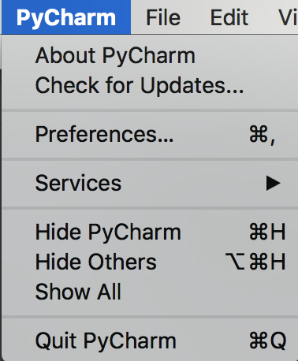
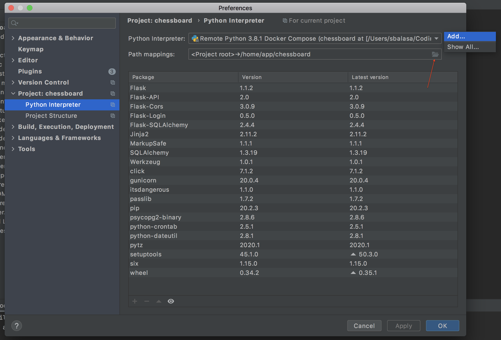
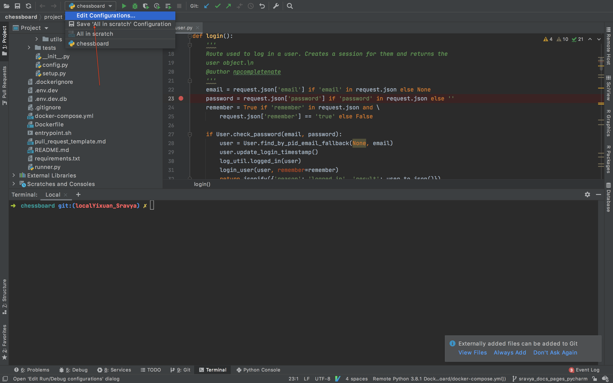
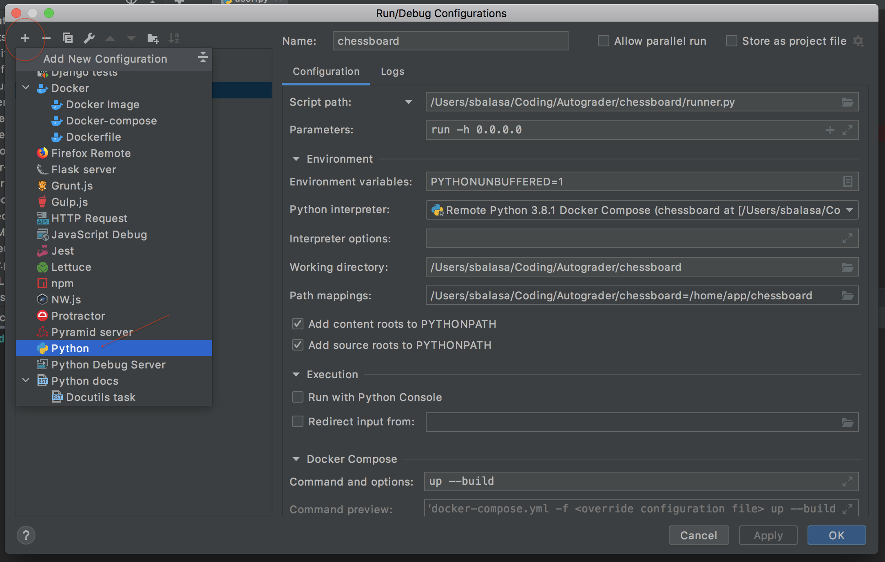
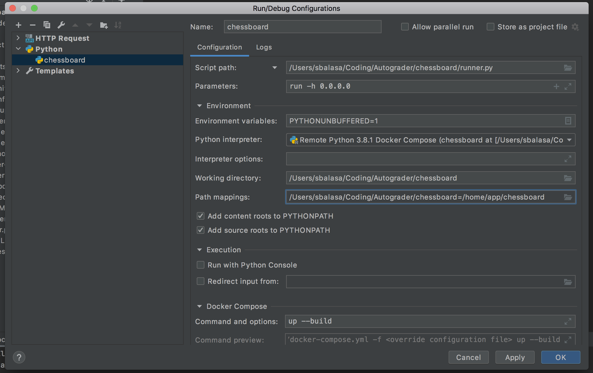
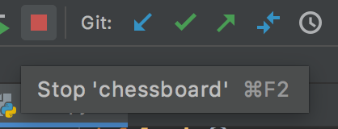

# Getting Started with Development

## PyCharm Debugger Setup
Follow the steps below to setup `chessboard` with a configuration to use Pycharm's Debug tool for Python, which allows you to set breakpoints, watch variables, etc.

#### Installing Pycharm

1. Make sure you have the [JetBrains Product Pack for Students](https://www.jetbrains.com/community/education/#students).
2. Download the Professional version of [PyCharm 2020.2.2](https://www.jetbrains.com/pycharm/download/#section=mac). (Older versions may not work!)
3. Follow the installation steps for PyCharm.
4. Open the `chessboard` directory in PyCharm.

#### Interpreter Setup

First, we need to setup the Python Interpreter to use the Docker Image set up on starting the project.

1. Select `Pycharm` &rarr; `Preferences`.
   
2. Select `Project:chessboard` &rarr; `Python Interpreter`.
3. Click the gear icon and select `Add`.
   
4. Fill out the form with the settings below for the interpreter and click `OK`.
   
5. Click on the folder icon add the end of the `Path Mappings` field to edit path mappings.
   
6. Click the `+` icon to add a new path mapping with the settings below and click `OK`. 
    1. NOTE: Replace `Local Path` with your path to `chessboard`.
   
7. Your screen should look like step 3. If so, click `Apply` and `OK`.

#### Run/Debug Configuration Setup

Then we need to setup a Run/Debug Configuration for `chessboard` which "specifies details such as app installation, launch, and test options".

1. Click on the dropdown indicated below and select `Edit Configurations`.
    
2. Click the `+` icon and select `Python` to add a Python Run/Debug Configuration.
    
3. Fill out the form with the settings below.
    1.  NOTE: Replace `Script Path` with your local path to `runner.py`.
    2.  NOTE: Replace `Working Directory` with your local path to `chessboard`.
	
4.  Click on the folder icon add the end of the `Path Mappings` field to edit path mappings.
5. Click the `+` icon to add a new path mapping with the settings below and click `OK`. 
    1. NOTE: Replace `Local Path` with your path to `chessboard`. 
	
6. Your screen should look like step 3. If so, click `Apply` and `OK`.

## Using the Debugger
Check out [this link](https://www.jetbrains.com/help/pycharm/part-1-debugging-python-code.html#breakpoints) to learn how to use Pycharm's Debug tool.

1. Set breakpoints by clicking in the margin on the left side of a line number. You should see a red dot next to the line.
2. Start a debug session by clicking the debug icon. Your docker image should build.
    
3. Stop a debug session by typing in `docker-compose down --volumes` in your terminal or clicking the stop icon.
    
4. Here's an example of a running debug session!
     

Happy debugging!! :)

### Sidenote: VSCode
If you prefer to use VSCode (and don't want the nice benefits of PyCharm), this is what you need to use
to set up. It can be downloaded <a href="https://code.visualstudio.com" target="_blank">here</a>.
Some useful plugins to install are Python and Docker, and you'll want to install `flake8` on pip3 (use `pip3 install flake8`).
You also may want to install vscode-icons and Visual Studio Intellicode here as well.

Flake8 is a linter which enforces strict style guidlines, so make sure to keep it happy and our code will look beautiful.
If you use PyCharm, you should have `flake8` already installed and yelling at you.

It's possible to configure VSCode to work with docker and debug as well, but I haven't done it before. If I ever decide to try and figure it out, I'll add instructions here.

## Local Development
If you're using PyCharm, hit the "debug" button (looks like a green bug). If not, open a terminal and run `docker-compose up --build`.
This will hijack your terminal, so if you want to still use the same window add a `-d` flag to that command.

To stop, if you're in PyCharm click the red stop sign. If not (and you ran with the `-d` flag) type `docker-compose down` to stop the image.
If you run into problems, run `docker-compose down --volumes` followed by `docker rmi $(docker images -q) --force` to wipe everything clean and do a fresh install.

Here are some more useful commands:
* `docker exec -it <image name> <app name>` (example `docker exec -it autograder_db bash`)
  * The `docker exec` command lets you execute a command on an image. This particular one lets you connect to the image so that you can do stuff like connect to the DB.
* `psql -U postgres -W autograder` (run inside of the `autograder_db` image)
  * This command lets you connect to the PostgreSQL monitor running inside of the Docker image. You'll need to type the password (check the env file).

To run in production, ask someone on the team to share that knowledge with you. #IYKYK.

<!--
To run in production, pull the latest image from DockerHub and then run `docker-compose down --volumes` && `docker-compose -f docker-compose.prod.yml up --build -d` -->
<!--
If the container doesn't run, type `docker-compose -f docker-compose.prod.yml logs -f` -->
<!-- 
We use <a href="https://hub.docker.com" target="_blank">DockerHub</a> for prod image management, so be sure
to make an account there. -->

## Useful Links
1. <a href="https://medium.com/@trstringer/debugging-a-python-flask-application-in-a-container-with-docker-compose-fa5be981ec9a" target="_blank">Debugging Flask Apps (for those who didn't set up PyCharm)</a>
2. <a href="https://testdriven.io/blog/dockerizing-flask-with-postgres-gunicorn-and-nginx/"
target="_blank">Docker configurations</a>

---
[Go back](/chessboard)
